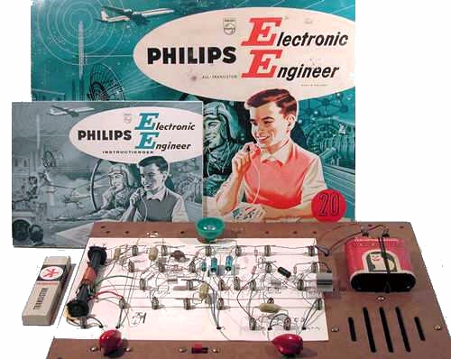

# EE 20 Simulator · Simulador EE 20



> **EN** — A realistic, bilingual (English / Português-BR) simulator of the 22 circuits of the *Philips Electronic Engineer EE 8 / EE 20* all-transistor assembly kit (instruction book, 1966).
> **PT** — Um simulador realista e bilíngue (inglês / português-BR) dos 22 circuitos do conjunto de montagem transistorizado *Philips Engenheiro Eletrônico EE 8 / EE 20* (livro de instruções, 1966).

**▶ Play online / Jogar online: <https://mjrovai.github.io/EE20-Simulator/sim/>**

| | |
|---|---|
| Project page · Página do projeto | <https://mjrovai.github.io/EE20-Simulator/> |
| Offline copy · Cópia offline (zip, ~80 KB) | [download/EE20-Simulator-offline.zip](https://mjrovai.github.io/EE20-Simulator/download/EE20-Simulator-offline.zip) |
| Instruction book, English (PDF, 54 MB) | [books/EE20-colour-en.pdf](https://mjrovai.github.io/EE20-Simulator/books/EE20-colour-en.pdf) |
| Livro de instruções, Português (PDF, 28 MB) | [books/EE20-br.pdf](https://mjrovai.github.io/EE20-Simulator/books/EE20-br.pdf) |

Source material (material de origem): the two instruction books above.

## Run it (Como rodar)

No build step, no dependencies. Download the offline zip (or clone this repo), then open `sim/index.html` in a browser. If your browser blocks scripts on local files, serve the folder with any static web server:

```bash
cd EE20-Simulator/sim
python3 -m http.server 8080
```

Then open <http://localhost:8080/>. Sound needs one click on the page first (per the browser autoplay rule). The microphone is optional and is requested only when you tick “Use my computer microphone”.

The language button (top right) switches EN ⇄ PT; the choice, the last circuit, and the last tab are remembered.


## What is simulated · O que é simulado

| Group | Circuits | Behaviur |
|---|---|---|
| A · Electro-acoustics | A1 earphone amplifier, A2 mic/gramophone amplifier, A3 push-pull, A4 Bi-Ampli, A5 electronic organ | Record player with public-domain tunes and vinyl crackle; microphone (real or simulated voice) with acoustic-feedback howl when the mic is near the loudspeaker; bass/treble split on two loudspeakers; 8-key organ (multivibrator tone, tune it with the potentiometer, resistor tolerance makes each build slightly different) |
| B · Telecommunications | B1/B2 Morse trainers, B3 intercom, B4 telephone amplifier | Morse key (mouse or Space) with a decoder of your own keying; an automatic “friend” sends texts at a chosen speed; two-way switch; intercom talk/listen with a remote room (friend, baby); pick-up coil hearing a telephone, bird-song, whisper, watch ticking |
| C · Radio | C1 one-, C2 two-, C3 three-transistor receivers | Medium-wave band 520–1620 kHz with eight simulated transmitters (music, Morse coast station, time pips, talk), tuning selectivity and static, ferroxcube-rod direction finding (null when the rod points at the transmitter), outside aerial, trawler band (C1), sunrise alarm with the LDR (C3) |
| D · Signaling | D1 tell-tale light, D2 flashing beacon, D3 acoustic relay, D4 / D4.1 pilfering alarms, D5 burglar alarm | LDR light model (room light, torch, hand cover), latching lamps with reset key, RC-timed flashing, sound-triggered relay (slider, clap, door slam or the real microphone), window/door contact, sliding-switch modes as in the book |
| E · Measuring & control | E1 night light, E2 moisture indicator, E3 time switch, E4 measuring bridge | Analog lamp brightness from the LDR divider with sensitivity potentiometer; sensing wires on pencil line, damp paper, hands, flower pot, water, diode, LDR; timer with stopwatch and calibration; bridge with a mystery resistor/capacitor / LDR — turn the knob for the null and read the ratio scale |

Every circuit has four tabs:

* **Mounting board** — the wiring card with photo-style parts (color-banded resistors, yellow polyester and blue electrolytic capacitors, AF 116 / AC 126 with heat sink, LDR, lamp holder), the batteries and loudspeaker grille, and the knobs of the real board. Click any part to inspect it.
* **Circuit diagram** — the blue Philips-style schematic, live: conducting transistors light up, keys, wiper, and slide switch move, the lamp glows.
* **Instruction book** — description, assembly notes, use, how it works, applications (adapted from the book), Morse table, fault-finding checklist.
* **Parts** — component list with resistor color codes.

Instruments: lamp, loudspeaker(s), earphone indicators, battery gauge with voltage and current (batteries slowly run down; fit fresh ones), oscilloscope (audio signal or the slow lamp trace), stopwatch, stations list.

**Fault-finding practice**: on the board tab, “Practice fault-finding” hides one assembly mistake (reversed transistor or electrolytic, wrong resistor, diode the wrong way, loose wire, dead lamp, flat batteries). The set misbehaves the way the book describes; inspect the parts to find and repair it.

Keyboard: `Space` = Morse/alarm key · `R` = reset key · `S` = sliding switch · `1–8` or `A S D F G H J K` = organ keys · `← →` = potentiometer.

## Notes on fidelity · Notas sobre fidelidade

* Circuit topologies follow the schematics in the “Description of circuits” chapter (book pages 62–72). Component values were read from the wiring-card photographs where the book shows them (A1, A5, B3, C1, D1, D4.1, E1); for the other circuits, the values are plausible choices from the kit’s resistor and capacitor set (47 Ω … 680 kΩ; 47 nF, 0.1 µF, 3.2 µF, 10 µF, 100 µF). The kit's potentiometer is a 10 kΩ logarithmic type with an on/off switch.
* The simulation is behavioral (RC time constants, LDR resistance versus light, divider thresholds, transistor on/off states), not a SPICE solver. Tones are synthesized with the Web Audio API; loudspeaker and earphone have their own frequency coloring.
* Transmitters, telephone voices, bird-song and the “friend” are all synthetic; music consists of public-domain melodies.


## Files

```
index.html              project landing page (bilingual), served by GitHub Pages
sim/index.html          simulator page shell
sim/css/style.css       1966 Philips look (blue/red/yellow, pegboard brown)
sim/js/parts.js         catalog, color code, Morse table, melodies
sim/js/i18n.js          UI strings EN / PT
sim/js/schematic.js     SVG renderer: symbolic diagram + mounting board from one layout
sim/js/audio.js         Web Audio engine (tones, noise, melodies, voices, radio programs, mic)
sim/js/circuits.js      22 circuits: bilingual text + layouts
sim/js/models.js        behavioral models
sim/js/app.js           UI, widgets, simulation loop, Morse decoder, fault-finding
books/                  the two instruction books (PDF)
images/                 photos and screenshots used by the landing page and this README
download/               offline zip (rebuild with tools/make-offline-zip.sh)
```

## Credits and license · Créditos e licença

* **EN** — Concept, research and direction by Marcelo Rovai ([mjrovai.com](https://mjrovai.com/)). The simulator code was generated by **Claude Fable 5.1** (Anthropic) working from the original instruction books, under the author's direction. Code is released under the [MIT license](LICENSE).
* **PT** — Concepção, pesquisa e direção de Marcelo Rovai ([mjrovai.com](https://mjrovai.com/)). O código do simulador foi gerado pelo **Claude Fable 5.1** (Anthropic) a partir dos livros de instruções originais, sob direção do autor. O código é distribuído sob a [licença MIT](LICENSE).
* The instruction books in `books/` are © Philips (1966). They are shared here for historical and educational purposes only. / Os livros de instruções em `books/` são © Philips (1966) e são compartilhados aqui apenas para fins históricos e educacionais.
* Photos of the kit and the period advertisements are reproduced for historical illustration. / As fotos do conjunto e os anúncios de época são reproduzidos para ilustração histórica.
